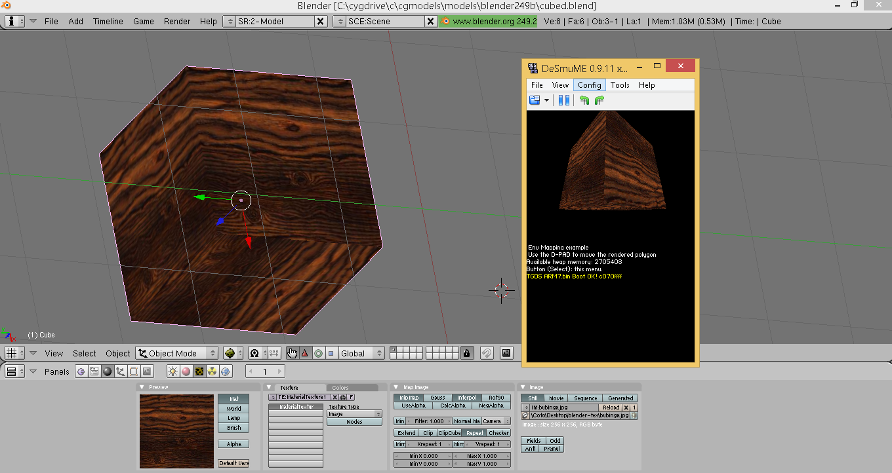
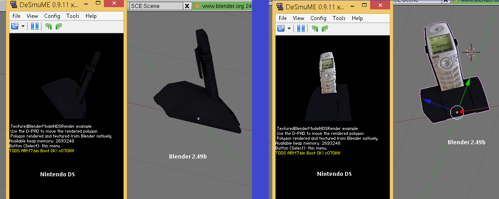

Textured Cube made in Blender 2.49b then exported as .H NDS CallList + .PCX Paletted Texture 

--
Textured OBJ imported on Blender 2.49b then exported as .H NDS CallList + .PCX Paletted Texture 

master: Development branch. Use TGDS1.65: branch for stable features.

3D Models exported from Blender and/or other 3D modelling tools into different target platforms such as NintendoDS.

Folder description:
/img: Shows the final result
/misc: Tools used to create these results
/models: Models themselves, the native format can be (.obj, .fbx, .dae, etc). 
/targetClientRenderers: Are the engine software performing the model rendering

Latest stable release:
https://bitbucket.org/Coto88/cgmodels/get/TGDS1.65.zip
